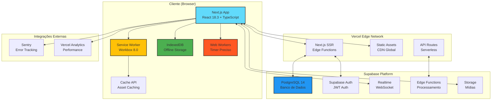
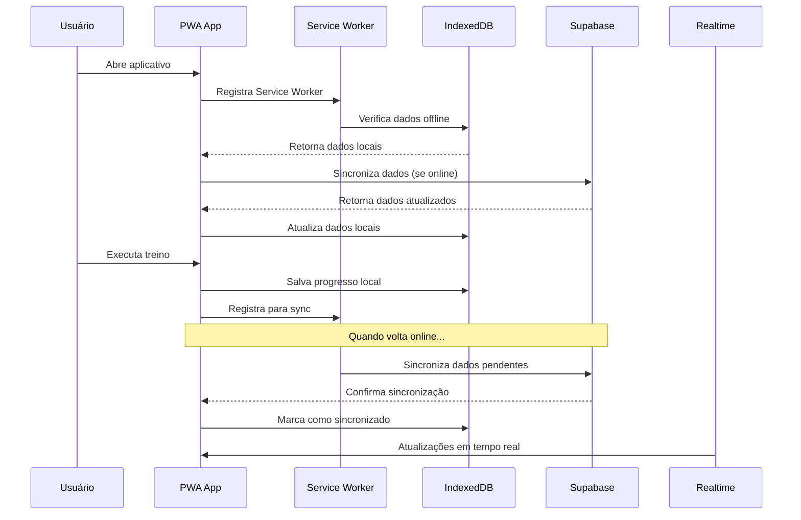
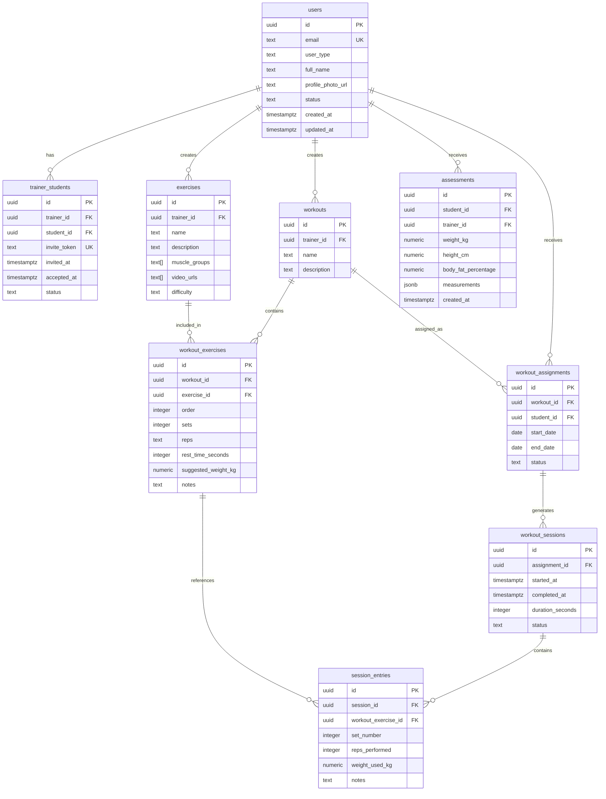
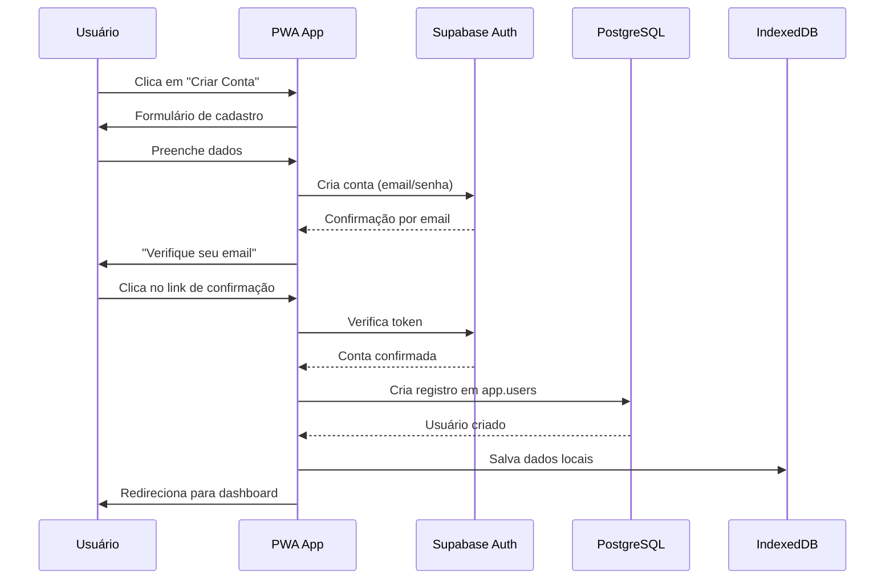
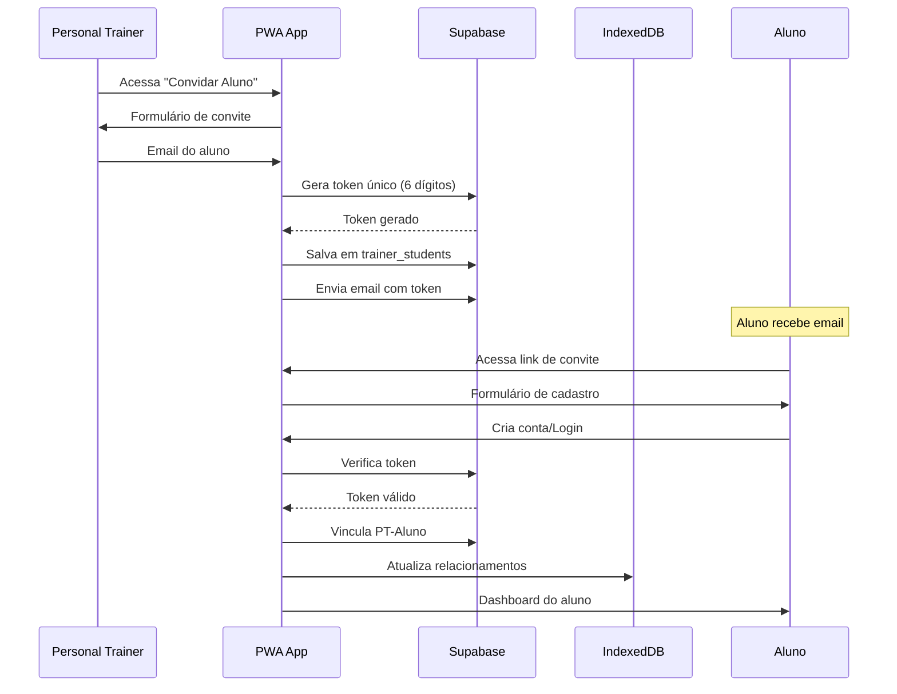

# Arquitetura do Sistema - Sistema PWA de Gerenciamento de Treinos

## 1. VISÃO GERAL DA ARQUITETURA

### 1.1. Filosofia Arquitetural

O sistema adota uma arquitetura **Progressive Web App (PWA)** moderna, construída sobre os princípios de:

- **Offline-First**: Funcionamento completo sem conexão de rede
- **Mobile-First**: Experiência otimizada para dispositivos móveis
- **Performance-First**: Carregamento rápido e interações fluides
- **Resilience-First**: Graceful degradation e fallbacks robustos

### 1.2. Diagrama de Arquitetura Geral



### 1.3. Fluxo de Dados



## 2. ARQUITETURA DO FRONTEND

### 2.1. Estrutura de Pastas

```
src/
├── app/                          # App Router (Next.js 15.1)
│   ├── (auth)/                   # Rotas de autenticação
│   │   ├── login/page.tsx
│   │   └── register/page.tsx
│   ├── (app)/                    # Rotas protegidas
│   │   ├── layout.tsx           # Layout principal
│   │   ├── dashboard/page.tsx
│   │   ├── workout/
│   │   │   ├── list/page.tsx
│   │   │   └── player/[id]/page.tsx
│   │   ├── exercises/page.tsx
│   │   └── profile/page.tsx
│   ├── api/                      # API Routes
│   │   ├── auth/
│   │   ├── sync/
│   │   └── webpush/
│   └── layout.tsx               # Layout raiz
│
├── components/
│   ├── ui/                      # Componentes genéricos (shadcn/ui)
│   │   ├── Button.tsx
│   │   ├── Card.tsx
│   │   ├── Dialog.tsx
│   │   ├── Form.tsx
│   │   └── Input.tsx
│   └── features/                # Componentes de funcionalidades
│       ├── auth/
│       ├── dashboard/
│       ├── workout-player/
│       ├── exercises/
│       └── assessments/
│
├── hooks/                       # Hooks customizados
│   ├── useTimerWorker.ts
│   ├── useWakeLock.ts
│   ├── useHaptic.ts
│   ├── useOfflineStorage.ts
│   ├── useBackgroundSync.ts
│   └── useSupabase.ts
│
├── lib/                         # Utilidades e configurações
│   ├── supabase/
│   │   ├── client.ts
│   │   └── server.ts
│   ├── utils.ts
│   ├── validators.ts
│   └── constants.ts
│
├── store/                       # Zustand stores
│   ├── user.store.ts
│   ├── workout.store.ts
│   └── ui.store.ts
│
├── types/                       # Definições de tipos TypeScript
│   ├── database.ts
│   ├── workout.ts
│   └── user.ts
│
├── public/                      # Assets estáticos
│   ├── icons/
│   ├── splash/
│   └── manifest.json
│
└── workers/                     # Web Workers
    ├── timer.worker.ts
    └── sync.worker.ts
```

### 2.2. Padrão de Componentes

Todos os componentes seguem o padrão de **Composition API** com TypeScript:

```typescript
// components/ui/Button.tsx
import { cn } from '@/lib/utils';
import { cva, type VariantProps } from 'class-variance-authority';

const buttonVariants = cva(
  'inline-flex items-center justify-center rounded-md text-sm font-medium transition-colors focus-visible:outline-none focus-visible:ring-2 focus-visible:ring-ring focus-visible:ring-offset-2 disabled:opacity-50 disabled:pointer-events-none ring-offset-background',
  {
    variants: {
      variant: {
        default: 'bg-primary text-primary-foreground hover:bg-primary/90',
        destructive: 'bg-destructive text-destructive-foreground hover:bg-destructive/90',
        outline: 'border border-input hover:bg-accent hover:text-accent-foreground',
        secondary: 'bg-secondary text-secondary-foreground hover:bg-secondary/80',
        ghost: 'hover:bg-accent hover:text-accent-foreground',
        link: 'underline-offset-4 hover:underline text-primary',
      },
      size: {
        default: 'h-10 py-2 px-4',
        sm: 'h-9 px-3 rounded-md',
        lg: 'h-11 px-8 rounded-md',
        icon: 'h-10 w-10',
      },
    },
    defaultVariants: {
      variant: 'default',
      size: 'default',
    },
  }
);

export interface ButtonProps
  extends React.ButtonHTMLAttributes<HTMLButtonElement>,
    VariantProps<typeof buttonVariants> {}

const Button = React.forwardRef<HTMLButtonElement, ButtonProps>(
  ({ className, variant, size, ...props }, ref) => {
    return (
      <button
        className={cn(buttonVariants({ variant, size, className }))}
        ref={ref}
        {...props}
      />
    );
  }
);
Button.displayName = 'Button';

export { Button, buttonVariants };
```

### 2.3. Gerenciamento de Estado

O projeto utiliza **Zustand** para estado global com a seguinte estratégia:

```typescript
// store/user.store.ts
import { create } from 'zustand';
import { persist } from 'zustand/middleware';

interface UserStore {
  user: User | null;
  isAuthenticated: boolean;
  userType: 'trainer' | 'student' | null;
  setUser: (user: User) => void;
  logout: () => void;
}

export const useUserStore = create<UserStore>()(
  persist(
    (set) => ({
      user: null,
      isAuthenticated: false,
      userType: null,
      setUser: (user) => set({ user, isAuthenticated: true, userType: user.user_type }),
      logout: () => set({ user: null, isAuthenticated: false, userType: null }),
    }),
    {
      name: 'user-storage',
    }
  )
);
```

## 3. ARQUITETURA DO BACKEND

### 3.1. Schema do Banco de Dados



### 3.2. Supabase Edge Functions

```typescript
// supabase/functions/calculate-body-composition/index.ts

import { serve } from 'https://deno.land/std@0.168.0/http/server.ts';
import { createClient } from 'https://esm.sh/@supabase/supabase-js@2';

const corsHeaders = {
  'Access-Control-Allow-Origin': '*',
  'Access-Control-Allow-Headers': 'authorization, x-client-info, apikey, content-type',
};

serve(async (req) => {
  if (req.method === 'OPTIONS') {
    return new Response('ok', { headers: corsHeaders });
  }

  try {
    const { weight_kg, height_cm, body_fat_percentage } = await req.json();

    // Validações
    if (!weight_kg || !height_cm || !body_fat_percentage) {
      throw new Error('Dados incompletos para cálculo');
    }

    // Cálculos antropométricos
    const height_m = height_cm / 100;
    const bmi = weight_kg / (height_m * height_m);
    const fat_mass_kg = (body_fat_percentage / 100) * weight_kg;
    const lean_mass_kg = weight_kg - fat_mass_kg;

    // Classificação IMC
    let bmi_classification = '';
    if (bmi < 18.5) bmi_classification = 'Abaixo do peso';
    else if (bmi < 24.9) bmi_classification = 'Peso normal';
    else if (bmi < 29.9) bmi_classification = 'Sobrepeso';
    else bmi_classification = 'Obesidade';

    return new Response(
      JSON.stringify({
        bmi: Math.round(bmi * 100) / 100,
        bmi_classification,
        fat_mass_kg: Math.round(fat_mass_kg * 100) / 100,
        lean_mass_kg: Math.round(lean_mass_kg * 100) / 100,
      }),
      {
        headers: { ...corsHeaders, 'Content-Type': 'application/json' },
        status: 200,
      }
    );
  } catch (error) {
    return new Response(
      JSON.stringify({ error: error.message }),
      {
        headers: { ...corsHeaders, 'Content-Type': 'application/json' },
        status: 400,
      }
    );
  }
});
```

## 4. ARQUITETURA PWA

### 4.1. Service Worker Strategy

```typescript
// public/service-worker.js

import { precacheAndRoute } from 'workbox-precaching';
import { registerRoute } from 'workbox-routing';
import { CacheFirst, NetworkFirst, StaleWhileRevalidate } from 'workbox-strategies';
import { ExpirationPlugin } from 'workbox-expiration';
import { BackgroundSyncPlugin } from 'workbox-background-sync';

// Precache de assets estáticos
precacheAndRoute(self.__WB_MANIFEST);

// Cache First: Imagens e fontes
registerRoute(
  ({ request }) => 
    request.destination === 'image' || 
    request.destination === 'font' ||
    request.destination === 'video',
  new CacheFirst({
    cacheName: 'static-assets',
    plugins: [
      new ExpirationPlugin({
        maxEntries: 150,
        maxAgeSeconds: 30 * 24 * 60 * 60, // 30 dias
      }),
    ],
  })
);

// Network First: APIs do Supabase
registerRoute(
  ({ url }) => url.origin.includes('supabase.co'),
  new NetworkFirst({
    cacheName: 'api-cache',
    networkTimeoutSeconds: 5,
    plugins: [
      new ExpirationPlugin({
        maxEntries: 50,
        maxAgeSeconds: 10 * 60, // 10 minutos
      }),
      new BackgroundSyncPlugin('sync-queue', {
        maxRetentionTime: 24 * 60, // 24 horas
      }),
    ],
  })
);

// Stale While Revalidate: HTML e JS
registerRoute(
  ({ request }) => 
    request.destination === 'document' ||
    request.destination === 'script' ||
    request.destination === 'style',
  new StaleWhileRevalidate({
    cacheName: 'content-cache',
  })
);
```

### 4.2. Web App Manifest

```json
{
  "name": "Sistema de Treinos - Personal Trainer",
  "short_name": "Treinos PT",
  "description": "App profissional de gerenciamento de treinos com timer preciso, avaliação física e sincronização offline",
  "id": "/",
  "start_url": "/",
  "scope": "/",
  "display_override": ["window-controls-overlay", "minimal-ui", "standalone"],
  "display": "standalone",
  "orientation": "portrait-primary",
  "theme_color": "#1f2937",
  "background_color": "#ffffff",
  "categories": ["health", "fitness", "sports"],
  "lang": "pt-BR",
  "dir": "ltr",
  "icons": [
    {
      "src": "/icons/icon-192x192.png",
      "sizes": "192x192",
      "type": "image/png",
      "purpose": "any"
    },
    {
      "src": "/icons/icon-192x192-maskable.png",
      "sizes": "192x192",
      "type": "image/png",
      "purpose": "maskable"
    },
    {
      "src": "/icons/icon-512x512.png",
      "sizes": "512x512",
      "type": "image/png",
      "purpose": "any"
    }
  ],
  "screenshots": [
    {
      "src": "/splash/splash-540x720.png",
      "sizes": "540x720",
      "type": "image/png",
      "form_factor": "narrow",
      "label": "Player de Treino"
    },
    {
      "src": "/splash/splash-1024x768.png",
      "sizes": "1024x768",
      "type": "image/png",
      "form_factor": "wide",
      "label": "Dashboard"
    }
  ],
  "shortcuts": [
    {
      "name": "Iniciar Treino de Hoje",
      "short_name": "Treino",
      "description": "Comece o treino programado para hoje",
      "url": "/workout/today",
      "icons": [
        {
          "src": "/icons/workout-96.png",
          "sizes": "96x96",
          "type": "image/png"
        }
      ]
    }
  ],
  "prefer_related_applications": false
}
```

## 5. FLUXO DE AUTENTICAÇÃO



## 6. FLUXO DE CONVITE E VINCULAÇÃO



## 7. ESTRATÉGIA DE CACHE

| Tipo de Recurso | Estratégia | Max Age | Max Entries |
|-----------------|------------|---------|-------------|
| HTML/JS/CSS | Stale While Revalidate | 1 dia | 50 |
| Imagens/Fontes | Cache First | 30 dias | 150 |
| APIs Supabase | Network First | 10 min | 50 |
| Dados Offline | IndexedDB | Permanente | Ilimitado |

## 8. ESTRATÉGIA DE SEGURANÇA

### 8.1. Autenticação e Autorização

```typescript
// lib/supabase/client.ts
import { createClient } from '@supabase/supabase-js';
import type { Database } from '@/types/database';

const supabaseUrl = process.env.NEXT_PUBLIC_SUPABASE_URL!;
const supabaseAnonKey = process.env.NEXT_PUBLIC_SUPABASE_ANON_KEY!;

export const supabase = createClient<Database>(supabaseUrl, supabaseAnonKey, {
  auth: {
    autoRefreshToken: true,
    persistSession: true,
    detectSessionInUrl: true,
    flowType: 'pkce',
  },
  global: {
    headers: {
      'x-application-name': 'treinos-pt',
    },
  },
  db: {
    schema: 'app',
  },
});
```

### 8.2. Row Level Security (RLS)

```sql
-- Política para tabela de exercícios
CREATE POLICY "Trainers can manage their own exercises" ON app.exercises
    FOR ALL USING (auth.uid() = trainer_id);

CREATE POLICY "Students can view exercises from their trainers" ON app.exercises
    FOR SELECT USING (
        EXISTS (
            SELECT 1 FROM app.trainer_students 
            WHERE student_id = auth.uid() 
            AND trainer_id = app.exercises.trainer_id
            AND status = 'active'
        )
    );
```

## 9. ESTRATÉGIA DE PERFORMANCE

### 9.1. Code Splitting

```typescript
// app/(app)/workout/player/[id]/page.tsx
import { Suspense, lazy } from 'react';

const WorkoutPlayer = lazy(() => import('@/components/features/workout-player/WorkoutPlayer'));

export default function WorkoutPlayerPage({ params }: { params: { id: string } }) {
  return (
    <Suspense fallback={<div>Carregando...</div>}>
      <WorkoutPlayer workoutId={params.id} />
    </Suspense>
  );
}
```

### 9.2. Optimização de Imagens

```typescript
// components/features/exercises/ExerciseCard.tsx
import Image from 'next/image';

export function ExerciseCard({ exercise }: { exercise: Exercise }) {
  return (
    <div className="exercise-card">
      <Image
        src={exercise.thumbnail_url}
        alt={exercise.name}
        width={300}
        height={200}
        placeholder="blur"
        blurDataURL={exercise.blur_data_url}
        loading="lazy"
        sizes="(max-width: 640px) 100vw, (max-width: 1024px) 50vw, 33vw"
      />
      <h3>{exercise.name}</h3>
    </div>
  );
}
```

## 10. DECISÕES DE DESIGN

### 10.1. Por que Next.js 15.1?

| Característica | Benefício |
|----------------|-----------|
| App Router | Server Components, streaming, layouts aninhados |
| Edge Runtime | Performance global, cold start rápido |
| TypeScript | Type safety em todo o projeto |
| Image Optimization | Imagens otimizadas automaticamente |
| Font Optimization | Fonts otimizadas e pre-carregadas |

### 10.2. Por que Supabase?

| Característica | Benefício |
|----------------|-----------|
| PostgreSQL | Banco relacional robusto com RLS |
| Realtime | Atualizações em tempo real sem configuração |
| Auth | Autenticação completa com JWT |
| Storage | Upload de mídias com CDN |
| Edge Functions | Processamento serverless |

### 10.3. Por que Zustand ao invés de Redux?

| Aspecto | Zustand | Redux |
|---------|---------|-------|
| Bundle Size | 1KB | 11KB |
| Boilerplate | Mínimo | Alto |
| Performance | Imutabilidade seletiva | Imutabilidade total |
| Curva de Aprendizado | Baixa | Alta |
| TypeScript | Excelente | Boa |

---

**Documento Version**: 1.0.0  
**Última Atualização**: 2025-01-01  
**Responsável**: Equipe de Arquitetura
