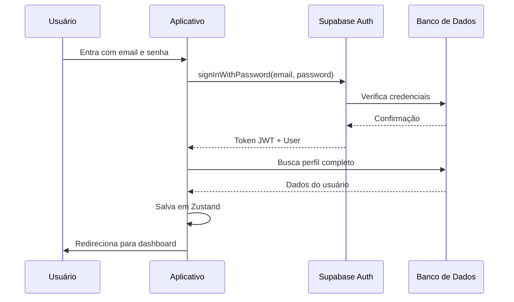
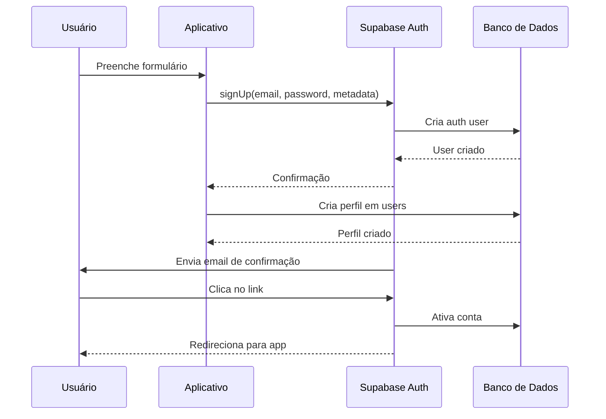
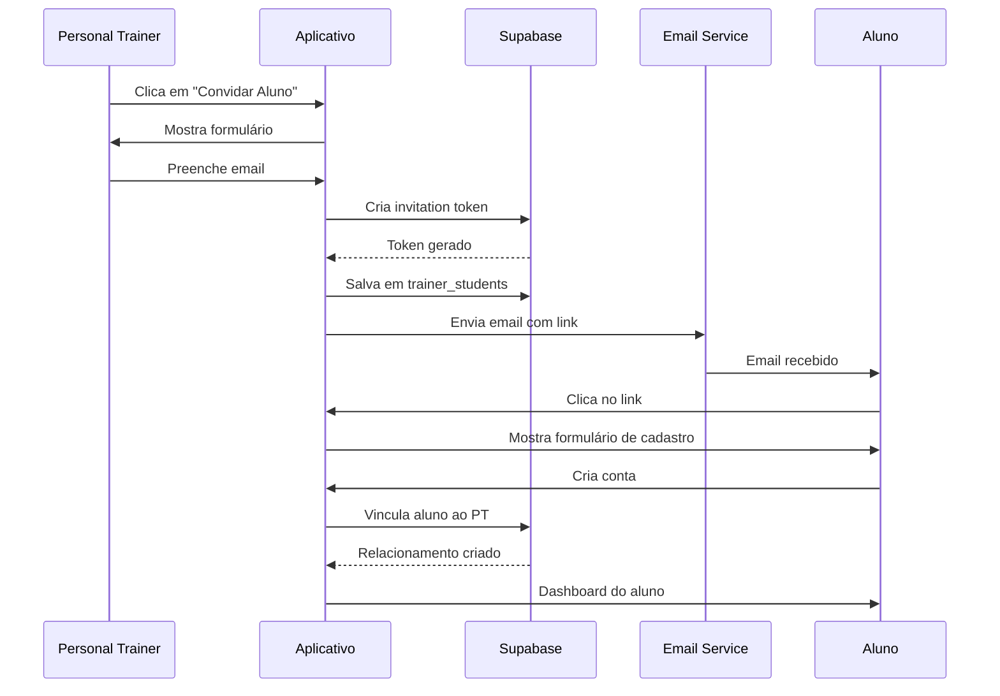

# Documentação da API - Sistema PWA de Gerenciamento de Treinos

## 1. VISÃO GERAL

Este documento descreve a documentação completa das APIs utilizadas no sistema, incluindo queries Supabase, políticas de Row Level Security (RLS), Edge Functions e fluxos de autenticação.

## 2. SUPABASE CLIENT

### 2.1. Configuração do Cliente

**Arquivo**: `/lib/supabase/client.ts`

```typescript
import { createClient } from '@supabase/supabase-js';
import type { Database } from '@/types/database';

const supabaseUrl = process.env.NEXT_PUBLIC_SUPABASE_URL!;
const supabaseAnonKey = process.env.NEXT_PUBLIC_SUPABASE_ANON_KEY!;

export const supabase = createClient<Database>(supabaseUrl, supabaseAnonKey, {
  auth: {
    autoRefreshToken: true,
    persistSession: true,
    detectSessionInUrl: true,
    flowType: 'pkce',
  },
  global: {
    headers: {
      'x-application-name': 'treinos-pt',
    },
  },
  db: {
    schema: 'app',
  },
  realtime: {
    params: {
      eventsPerSecond: 10,
    },
  },
});
```

### 2.2. Configuração do Cliente Servidor

**Arquivo**: `/lib/supabase/server.ts`

```typescript
import { createClient } from '@supabase/supabase-js';
import type { Database } from '@/types/database';

const supabaseUrl = process.env.NEXT_PUBLIC_SUPABASE_URL!;
const supabaseServiceRoleKey = process.env.SUPABASE_SERVICE_ROLE_KEY!;

export const supabaseAdmin = createClient<Database>(supabaseUrl, supabaseServiceRoleKey, {
  auth: {
    autoRefreshToken: false,
    persistSession: false,
  },
  db: {
    schema: 'app',
  },
});
```

## 3. QUERIES SUPABASE

### 3.1. Autenticação

#### 3.1.1. Sign Up

```typescript
const { data, error } = await supabase.auth.signUp({
  email: 'user@example.com',
  password: 'password123',
  options: {
    data: {
      full_name: 'John Doe',
      user_type: 'student', // 'trainer' | 'student'
    },
  },
});
```

#### 3.1.2. Sign In

```typescript
const { data, error } = await supabase.auth.signInWithPassword({
  email: 'user@example.com',
  password: 'password123',
});
```

#### 3.1.3. Sign Out

```typescript
const { error } = await supabase.auth.signOut();
```

#### 3.1.4. Get Session

```typescript
const { data: { session }, error } = await supabase.auth.getSession();
```

### 3.2. Users

#### 3.2.1. Get Current User

```typescript
const { data: { user }, error } = await supabase.auth.getUser();

// Com dados do perfil
const { data, error } = await supabase
  .from('users')
  .select('*')
  .eq('id', user?.id)
  .single();
```

#### 3.2.2. Update User Profile

```typescript
const { error } = await supabase
  .from('users')
  .update({
    full_name: 'New Name',
    phone: '+5511999999999',
    bio: 'Personal trainer especializado em...',
    specialties: ['musculação', 'funcional'],
  })
  .eq('id', userId);
```

#### 3.2.3. List Users (Trainer View)

```typescript
// Personal trainers podem ver seus alunos
const { data, error } = await supabase
  .from('users')
  .select(`
    *,
    trainer_students!inner(
      status,
      invited_at,
      accepted_at
    )
  `)
  .eq('trainer_students.trainer_id', trainerId)
  .eq('user_type', 'student');
```

### 3.3. Trainer-Students Relationship

#### 3.3.1. Create Invitation

```typescript
const inviteCode = generateInviteCode(); // Função para gerar código de 6 dígitos

const { data, error } = await supabase
  .from('trainer_students')
  .insert({
    trainer_id: trainerId,
    student_id: null, // Será preenchido quando aluno aceitar
    invite_token: crypto.randomUUID(),
    invite_code: inviteCode,
    invited_at: new Date().toISOString(),
    expires_at: new Date(Date.now() + 24 * 60 * 60 * 1000).toISOString(), // 24 horas
    status: 'pending',
    invited_by: trainerId,
  });
```

#### 3.3.2. Accept Invitation

```typescript
const { data, error } = await supabase
  .from('trainer_students')
  .update({
    student_id: studentId,
    accepted_at: new Date().toISOString(),
    status: 'active',
  })
  .eq('invite_code', inviteCode)
  .eq('status', 'pending')
  .gt('expires_at', new Date().toISOString());
```

#### 3.3.3. List Trainer Students

```typescript
const { data, error } = await supabase
  .from('trainer_students')
  .select(`
    *,
    student:users!student_id(*)
  `)
  .eq('trainer_id', trainerId)
  .in('status', ['active', 'pending']);
```

### 3.4. Exercises

#### 3.4.1. Create Exercise

```typescript
const { data, error } = await supabase
  .from('exercises')
  .insert({
    trainer_id: trainerId,
    name: 'Supino Reto',
    description: 'Exercício para peito com barra',
    instructions: '1. Deite-se no banco...\n2. Segure a barra...',
    muscle_groups: ['peito', 'tríceps', 'ombros'],
    equipment: 'barbell',
    exercise_type: 'strength',
    difficulty: 'intermediário',
    video_urls: ['https://example.com/video.mp4'],
    image_urls: ['https://example.com/image.jpg'],
    tags: ['musculação', 'peito'],
    is_public: false,
  })
  .select()
  .single();
```

#### 3.4.2. List Exercises

```typescript
// Personal trainer vê todos os seus exercícios
const { data, error } = await supabase
  .from('exercises')
  .select('*')
  .eq('trainer_id', trainerId)
  .eq('status', 'active')
  .order('created_at', { ascending: false });

// Aluno vê exercícios do seu personal trainer
const { data, error } = await supabase
  .from('exercises')
  .select(`
    *,
    trainer:users!trainer_id(id, full_name, profile_photo_url)
  `)
  .or(`trainer_id.eq.${trainerId},is_public.eq.true`)
  .eq('status', 'active');
```

#### 3.4.3. Search Exercises

```typescript
const { data, error } = await supabase
  .from('exercises')
  .select('*')
  .eq('trainer_id', trainerId)
  .textSearch('name', searchTerm)
  .filter('muscle_groups', 'cs', `{${muscleGroup}}`) // contains
  .eq('difficulty', difficulty)
  .order('created_at', { ascending: false });
```

### 3.5. Workouts

#### 3.5.1. Create Workout

```typescript
const { data: workout, error } = await supabase
  .from('workouts')
  .insert({
    trainer_id: trainerId,
    name: 'Treino A - Peito e Tríceps',
    description: 'Treino focado em peito e tríceps',
    workout_type: 'strength',
    difficulty: 'intermediário',
    estimated_duration_minutes: 60,
    tags: ['peito', 'tríceps', 'força'],
    status: 'active',
  })
  .select()
  .single();

// Adiciona exercícios ao treino
const { error: exercisesError } = await supabase
  .from('workout_exercises')
  .insert([
    {
      workout_id: workout.id,
      exercise_id: exercise1Id,
      order: 1,
      sets: 4,
      reps: '8-12',
      rest_time_seconds: 90,
      suggested_weight_kg: 60,
      notes: 'Foco na execução lenta',
    },
    {
      workout_id: workout.id,
      exercise_id: exercise2Id,
      order: 2,
      sets: 3,
      reps: '12-15',
      rest_time_seconds: 60,
      suggested_weight_kg: 40,
    },
  ]);
```

#### 3.5.2. Get Workout with Exercises

```typescript
const { data, error } = await supabase
  .from('workouts')
  .select(`
    *,
    workout_exercises (
      *,
      exercise:exercises (*)
    )
  `)
  .eq('id', workoutId)
  .single();
```

#### 3.5.3. List Workouts

```typescript
// Para personal trainer
const { data, error } = await supabase
  .from('workouts')
  .select(`
    *,
    workout_exercises(count)
  `)
  .eq('trainer_id', trainerId)
  .order('created_at', { ascending: false });

// Para aluno (apenas treinos atribuídos)
const { data, error } = await supabase
  .from('workouts')
  .select(`
    *,
    workout_assignments!inner(*)
  `)
  .eq('workout_assignments.student_id', studentId)
  .eq('workout_assignments.status', 'active');
```

### 3.6. Workout Assignments

#### 3.6.1. Assign Workout to Student

```typescript
const { data, error } = await supabase
  .from('workout_assignments')
  .insert({
    workout_id: workoutId,
    student_id: studentId,
    start_date: new Date().toISOString().split('T')[0],
    end_date: new Date(Date.now() + 30 * 24 * 60 * 60 * 1000).toISOString().split('T')[0], // 30 dias
    frequency_days: [1, 3, 5], // Segunda, Quarta, Sexta
    status: 'active',
    assigned_by: trainerId,
  });
```

#### 3.6.2. Get Today's Workouts

```typescript
const today = new Date().getDay(); // 0 = Domingo, 1 = Segunda...

const { data, error } = await supabase
  .from('workout_assignments')
  .select(`
    *,
    workout:workouts(*),
    student:users!student_id(*)
  `)
  .eq('student_id', studentId)
  .eq('status', 'active')
  .lte('start_date', new Date().toISOString().split('T')[0])
  .or(`end_date.is.null,end_date.gte.${new Date().toISOString().split('T')[0]}`)
  .contains('frequency_days', `{${today}}`);
```

### 3.7. Workout Sessions

#### 3.7.1. Start Workout Session

```typescript
const { data: session, error } = await supabase
  .from('workout_sessions')
  .insert({
    assignment_id: assignmentId,
    started_at: new Date().toISOString(),
    status: 'in_progress',
  })
  .select()
  .single();
```

#### 3.7.2. Complete Workout Session

```typescript
const { data, error } = await supabase
  .from('workout_sessions')
  .update({
    completed_at: new Date().toISOString(),
    duration_seconds: duration,
    status: 'completed',
    performance_rating: 4,
    energy_level: 3,
    notes: 'Treino muito bom, senti bastante',
  })
  .eq('id', sessionId);
```

#### 3.7.3. Get Workout History

```typescript
const { data, error } = await supabase
  .from('workout_sessions')
  .select(`
    *,
    assignment:workout_assignments(
      workout:workouts(*)
    )
  `)
  .eq('assignment.student_id', studentId)
  .eq('status', 'completed')
  .order('started_at', { ascending: false })
  .limit(10);
```

### 3.8. Session Entries

#### 3.8.1. Record Exercise Set

```typescript
const { data, error } = await supabase
  .from('session_entries')
  .insert({
    session_id: sessionId,
    workout_exercise_id: workoutExerciseId,
    set_number: setNumber,
    reps_performed: reps,
    weight_used_kg: weight,
    duration_seconds: duration,
    perceived_exertion: 8, // 1-10
    notes: 'Consegui completar com boa forma',
  });
```

#### 3.8.2. Get Exercise Progress

```typescript
const { data, error } = await supabase
  .from('session_entries')
  .select(`
    *,
    session:workout_sessions(
      started_at,
      assignment:workout_assignments(
        workout:workouts(name)
      )
    ),
    workout_exercise:workout_exercises(
      exercise:exercises(name)
    )
  `)
  .eq('workout_exercise.exercise_id', exerciseId)
  .order('session.started_at', { ascending: true });
```

### 3.9. Assessments

#### 3.9.1. Create Assessment

```typescript
const { data, error } = await supabase
  .from('assessments')
  .insert({
    student_id: studentId,
    trainer_id: trainerId,
    weight_kg: 75.5,
    height_cm: 175,
    body_fat_percentage: 15.2,
    measurements: {
      neck: 38.5,
      chest: 98.0,
      waist: 82.5,
      hips: 95.0,
      bicep_left: 32.0,
      bicep_right: 32.5,
      thigh_left: 58.0,
      thigh_right: 58.5,
      calf_left: 38.0,
      calf_right: 38.5,
    },
    goals: 'Perder gordura e ganhar massa muscular',
    observations: 'Bom progresso nos últimos 3 meses',
    status: 'completed',
    assessment_date: new Date().toISOString().split('T')[0],
  })
  .select()
  .single();
```

#### 3.9.2. Get Assessment History

```typescript
const { data, error } = await supabase
  .from('assessments')
  .select('*')
  .eq('student_id', studentId)
  .eq('status', 'completed')
  .order('assessment_date', { ascending: false });
```

### 3.10. Realtime Subscriptions

#### 3.10.1. Subscribe to Workout Updates

```typescript
import { RealtimeChannel } from '@supabase/supabase-js';

let subscription: RealtimeChannel;

// Inscreve-se em mudanças nos treinos do personal trainer
subscription = supabase
  .channel('workout-changes')
  .on(
    'postgres_changes',
    {
      event: '*', // INSERT, UPDATE, DELETE
      schema: 'app',
      table: 'workouts',
      filter: `trainer_id=eq.${trainerId}`,
    },
    (payload) => {
      console.log('Workout changed:', payload);
      handleWorkoutChange(payload);
    }
  )
  .subscribe();

// Cancelar inscrição
subscription.unsubscribe();
```

#### 3.10.2. Subscribe to Student Progress

```typescript
// Personal trainer escuta quando aluno completa treino
const subscription = supabase
  .channel('student-progress')
  .on(
    'postgres_changes',
    {
      event: 'INSERT',
      schema: 'app',
      table: 'workout_sessions',
    },
    async (payload) => {
      // Verifica se é um dos seus alunos
      const { data: assignment } = await supabase
        .from('workout_assignments')
        .select('student_id, workout:workouts(trainer_id)')
        .eq('id', payload.new.assignment_id)
        .single();

      if (assignment?.workout.trainer_id === trainerId) {
        console.log('Student completed workout:', payload.new);
        showNotification(assignment.student_id, payload.new);
      }
    }
  )
  .subscribe();
```

## 4. ROW LEVEL SECURITY (RLS)

### 4.1. Políticas de Usuários

```sql
-- Users podem ver seu próprio perfil
CREATE POLICY "Users can view their own profile" ON app.users
    FOR SELECT USING (auth.uid() = id);

-- Users podem atualizar seu próprio perfil
CREATE POLICY "Users can update their own profile" ON app.users
    FOR UPDATE USING (auth.uid() = id);

-- Personal trainers podem ver seus alunos
CREATE POLICY "Trainers can view their students" ON app.users
    FOR SELECT USING (
        user_type = 'student' AND 
        EXISTS (
            SELECT 1 FROM app.trainer_students 
            WHERE trainer_id = auth.uid() 
            AND student_id = users.id
            AND status = 'active'
        )
    );
```

### 4.2. Políticas de Exercícios

```sql
-- Personal trainers podem gerenciar seus próprios exercícios
CREATE POLICY "Trainers can manage their own exercises" ON app.exercises
    FOR ALL USING (auth.uid() = trainer_id);

-- Alunos podem ver exercícios do seu personal trainer
CREATE POLICY "Students can view exercises from their trainers" ON app.exercises
    FOR SELECT USING (
        EXISTS (
            SELECT 1 FROM app.trainer_students 
            WHERE student_id = auth.uid() 
            AND trainer_id = app.exercises.trainer_id
            AND status = 'active'
        )
    );

-- Alunos podem ver exercícios públicos
CREATE POLICY "Students can view public exercises" ON app.exercises
    FOR SELECT USING (is_public = TRUE);
```

### 4.3. Políticas de Treinos

```sql
-- Personal trainers podem gerenciar seus próprios treinos
CREATE POLICY "Trainers can manage their own workouts" ON app.workouts
    FOR ALL USING (auth.uid() = trainer_id);

-- Alunos podem ver treinos atribuídos a eles
CREATE POLICY "Students can view assigned workouts" ON app.workouts
    FOR SELECT USING (
        EXISTS (
            SELECT 1 FROM app.workout_assignments 
            WHERE student_id = auth.uid() 
            AND workout_id = app.workouts.id
            AND status = 'active'
        )
    );
```

### 4.4. Políticas de Sessões

```sql
-- Alunos podem gerenciar suas próprias sessões
CREATE POLICY "Students can manage their sessions" ON app.workout_sessions
    FOR ALL USING (
        EXISTS (
            SELECT 1 FROM app.workout_assignments wa
            WHERE wa.id = workout_sessions.assignment_id
            AND wa.student_id = auth.uid()
        )
    );

-- Personal trainers podem ver sessões dos seus alunos
CREATE POLICY "Trainers can view student sessions" ON app.workout_sessions
    FOR SELECT USING (
        EXISTS (
            SELECT 1 FROM app.workout_sessions ws
            JOIN app.workout_assignments wa ON ws.assignment_id = wa.id
            JOIN app.workouts w ON wa.workout_id = w.id
            WHERE ws.id = workout_sessions.id
            AND w.trainer_id = auth.uid()
        )
    );
```

### 4.5. Políticas de Avaliações

```sql
-- Alunos podem ver suas próprias avaliações
CREATE POLICY "Students can view their assessments" ON app.assessments
    FOR SELECT USING (auth.uid() = student_id);

-- Personal trainers podem gerenciar avaliações dos seus alunos
CREATE POLICY "Trainers can manage their students assessments" ON app.assessments
    FOR ALL USING (
        auth.uid() = trainer_id AND
        EXISTS (
            SELECT 1 FROM app.trainer_students 
            WHERE trainer_id = auth.uid() 
            AND student_id = assessments.student_id
            AND status = 'active'
        )
    );
```

## 5. EDGE FUNCTIONS

### 5.1. Cálculo de Composição Corporal

**Arquivo**: `/supabase/functions/calculate-body-composition/index.ts`

```typescript
import { serve } from 'https://deno.land/std@0.168.0/http/server.ts';

const corsHeaders = {
  'Access-Control-Allow-Origin': '*',
  'Access-Control-Allow-Headers': 'authorization, x-client-info, apikey, content-type',
};

serve(async (req) => {
  // Handle CORS preflight
  if (req.method === 'OPTIONS') {
    return new Response('ok', { headers: corsHeaders });
  }

  try {
    const { weight_kg, height_cm, body_fat_percentage, age, gender } = await req.json();

    // Validações
    if (!weight_kg || !height_cm) {
      throw new Error('Peso e altura são obrigatórios');
    }

    if (weight_kg <= 0 || height_cm <= 0) {
      throw new Error('Peso e altura devem ser positivos');
    }

    if (height_cm > 300) {
      throw new Error('Altura inválida');
    }

    // Cálculos básicos
    const height_m = height_cm / 100;
    const bmi = weight_kg / (height_m * height_m);
    
    // Classificação IMC
    let bmi_classification = '';
    if (bmi < 18.5) {
      bmi_classification = 'Abaixo do peso';
    } else if (bmi < 24.9) {
      bmi_classification = 'Peso normal';
    } else if (bmi < 29.9) {
      bmi_classification = 'Sobrepeso';
    } else {
      bmi_classification = 'Obesidade';
    }

    // Cálculos de composição corporal
    let fat_mass_kg = null;
    let lean_mass_kg = null;
    let body_fat_category = null;

    if (body_fat_percentage) {
      fat_mass_kg = (body_fat_percentage / 100) * weight_kg;
      lean_mass_kg = weight_kg - fat_mass_kg;
      
      // Categorias de gordura corporal
      if (gender === 'male') {
        if (body_fat_percentage < 6) body_fat_category = 'Essencial';
        else if (body_fat_percentage < 14) body_fat_category = 'Atleta';
        else if (body_fat_percentage < 18) body_fat_category = 'Fitness';
        else if (body_fat_percentage < 25) body_fat_category = 'Normal';
        else body_fat_category = 'Obesidade';
      } else {
        if (body_fat_percentage < 14) body_fat_category = 'Essencial';
        else if (body_fat_percentage < 21) body_fat_category = 'Atleta';
        else if (body_fat_percentage < 25) body_fat_category = 'Fitness';
        else if (body_fat_percentage < 32) body_fat_category = 'Normal';
        else body_fat_category = 'Obesidade';
      }
    }

    // Cálculo de metabolismo basal (Harris-Benedict)
    let bmr = null;
    if (age && gender) {
      if (gender === 'male') {
        bmr = 88.362 + (13.397 * weight_kg) + (4.799 * height_cm) - (5.677 * age);
      } else {
        bmr = 447.593 + (9.247 * weight_kg) + (3.098 * height_cm) - (4.330 * age);
      }
    }

    return new Response(
      JSON.stringify({
        bmi: Math.round(bmi * 100) / 100,
        bmi_classification,
        fat_mass_kg: fat_mass_kg ? Math.round(fat_mass_kg * 100) / 100 : null,
        lean_mass_kg: lean_mass_kg ? Math.round(lean_mass_kg * 100) / 100 : null,
        body_fat_category,
        bmr: bmr ? Math.round(bmr) : null,
      }),
      {
        headers: { ...corsHeaders, 'Content-Type': 'application/json' },
        status: 200,
      }
    );
  } catch (error) {
    return new Response(
      JSON.stringify({ 
        error: error instanceof Error ? error.message : 'Unknown error' 
      }),
      {
        headers: { ...corsHeaders, 'Content-Type': 'application/json' },
        status: 400,
      }
    );
  }
});
```

### 5.2. Processamento de Vídeos

**Arquivo**: `/supabase/functions/process-video/index.ts`

```typescript
import { serve } from 'https://deno.land/std@0.168.0/http/server.ts';
import { createClient } from 'https://esm.sh/@supabase/supabase-js@2';

const corsHeaders = {
  'Access-Control-Allow-Origin': '*',
  'Access-Control-Allow-Headers': 'authorization, x-client-info, apikey, content-type',
};

serve(async (req) => {
  if (req.method === 'OPTIONS') {
    return new Response('ok', { headers: corsHeaders });
  }

  try {
    const { videoUrl, exerciseId } = await req.json();
    
    // Cria cliente Supabase com service role key
    const supabase = createClient(
      Deno.env.get('SUPABASE_URL')!,
      Deno.env.get('SUPABASE_SERVICE_ROLE_KEY')!
    );

    // Processa o vídeo (gera thumbnail, extrai frames, etc.)
    const processedData = await processVideo(videoUrl);

    // Atualiza o exercício com dados processados
    const { error } = await supabase
      .from('exercises')
      .update({
        thumbnail_url: processedData.thumbnailUrl,
        duration_seconds: processedData.duration,
        video_metadata: processedData.metadata,
        processed_at: new Date().toISOString(),
      })
      .eq('id', exerciseId);

    if (error) throw error;

    return new Response(
      JSON.stringify({ success: true, data: processedData }),
      {
        headers: { ...corsHeaders, 'Content-Type': 'application/json' },
        status: 200,
      }
    );
  } catch (error) {
    return new Response(
      JSON.stringify({ 
        error: error instanceof Error ? error.message : 'Unknown error' 
      }),
      {
        headers: { ...corsHeaders, 'Content-Type': 'application/json' },
        status: 400,
      }
    );
  }
});

async function processVideo(videoUrl: string) {
  // Implementação do processamento de vídeo
  // - Gera thumbnail
  // - Extrai duração
  // - Analisa qualidade
  // - Gera preview
  
  return {
    thumbnailUrl: 'https://...',
    duration: 120,
    metadata: {
      width: 1920,
      height: 1080,
      fps: 30,
      codec: 'h264',
    },
  };
}
```

## 6. FLUXOS DE AUTENTICAÇÃO

### 6.1. Fluxo de Login



### 6.2. Fluxo de Cadastro



### 6.3. Fluxo de Convite



## 7. UTILITÁRIOS E HELPERS

### 7.1. Query Builder para Filtros Complexos

**Arquivo**: `/lib/supabase/query-builder.ts`

```typescript
import { PostgrestFilterBuilder } from '@supabase/postgrest-js';

interface WorkoutFilters {
  trainerId?: string;
  difficulty?: string;
  muscleGroups?: string[];
  equipment?: string[];
  searchTerm?: string;
  isPublic?: boolean;
}

export function buildExerciseQuery(
  baseQuery: any,
  filters: WorkoutFilters
) {
  let query = baseQuery;

  if (filters.trainerId) {
    query = query.eq('trainer_id', filters.trainerId);
  }

  if (filters.difficulty) {
    query = query.eq('difficulty', filters.difficulty);
  }

  if (filters.muscleGroups && filters.muscleGroups.length > 0) {
    query = query.contains('muscle_groups', filters.muscleGroups);
  }

  if (filters.equipment && filters.equipment.length > 0) {
    query = query.in('equipment', filters.equipment);
  }

  if (filters.searchTerm) {
    query = query.textSearch('name', filters.searchTerm);
  }

  if (filters.isPublic !== undefined) {
    query = query.eq('is_public', filters.isPublic);
  }

  return query.order('created_at', { ascending: false });
}
```

### 7.2. Paginação

```typescript
interface PaginationOptions {
  page: number;
  pageSize: number;
}

interface PaginatedResult<T> {
  data: T[];
  total: number;
  page: number;
  pageSize: number;
  totalPages: number;
}

export async function paginatedQuery<T>(
  query: any,
  options: PaginationOptions
): Promise<PaginatedResult<T>> {
  const from = (options.page - 1) * options.pageSize;
  const to = from + options.pageSize - 1;

  const { data, error, count } = await query
    .range(from, to)
    .limit(options.pageSize);

  if (error) throw error;

  return {
    data: data || [],
    total: count || 0,
    page: options.page,
    pageSize: options.pageSize,
    totalPages: Math.ceil((count || 0) / options.pageSize),
  };
}
```

---

**Documento Version**: 1.0.0  
**Última Atualização**: 2025-01-01  
**Responsável**: Equipe de Backend
